<div align="center">


# 🌱 Grainor

**Gestion des semences pour maraîcher·ère semi‑professionnel·le**

*Classifier · Entreposer · Planifier · Récupérer ses graines*


</div>

---

## 🌾 Pourquoi Grainor ?

Grainor s'adresse à un **maraîcher semi‑professionnel** qui produit et conserve ses propres
semences. L'app est pensée pour être **dense et efficace** (pas un gadget grand public) :
repérage rapide au champ comme à l'atelier, données fiables, et un vrai savoir‑faire sur la
**récupération des graines** espèce par espèce.

L'app fonctionne **hors‑ligne par défaut** : toutes les données vivent sur l'appareil.

### Les 4 piliers

| | Pilier | Ce que ça couvre |
|---|---|---|
| 🗂️ | **Classifier** | Catalogue des variétés + classification botanique complète |
| 📦 | **Entreposer** | Inventaire par zone de stockage, quantités, conditions |
| 🗓️ | **Planifier** | Calendrier de semis (par mois + agenda annuel semis/récolte) |
| 🌱 | **Récupérer** | Journal de récolte de graines + guides « comment procéder » + suivi de viabilité |

---

## 📱 Écrans

| # | Écran | État |
|---|-------|------|
| 🏠 | **Accueil** — tableau de bord, à semer, à surveiller | ✅ implémenté |
| 📖 | **Catalogue** — recherche + filtres par famille botanique | ✅ implémenté |
| 🔎 | **Fiche détail** — viabilité, classification, guide de récupération | ✅ implémenté |
| 🌾 | **Récoltes** — journal de récupération des semences | ✅ implémenté |
| ✍️ | **Noter une récolte** — variété, méthode, statut, notes | ✅ implémenté |
| 📦 | **Inventaire** — zones d'entreposage et remplissage | ✅ implémenté |
| 🗓️ | **Calendrier** — par mois + agenda annuel | ✅ implémenté |
| ➕ | **Ajouter une graine** — assistant IA + saisie manuelle | ✅ implémenté |
| ⚙️ | **Paramètres** — clé OpenRouter (stockage local sécurisé) | ✅ implémenté |

> ✅ Les **8 écrans + navigation** sont implémentés. La *Définition de « terminé »* (§9 du handoff) est couverte.

> Navigation : 5 onglets en bas (Accueil · Catalogue · Récoltes · Inventaire · Calendrier),
> un bouton **＋** flottant pour ajouter une variété, et les Paramètres accessibles depuis l'entête.

### 📸 Aperçu des écrans

> Captures de référence du design (dossier [`design_handoff_grainor/screenshots/`](design_handoff_grainor/screenshots/)) —
> **reproduites à l'identique** par l'app (mêmes tokens, mêmes composants). Pour des captures
> prises sur appareil, lancez l'app (cf. *Démarrer*) puis ajoutez‑les dans `docs/screenshots/`.

**Accueil · Catalogue · Fiche détail**

<div align="center">
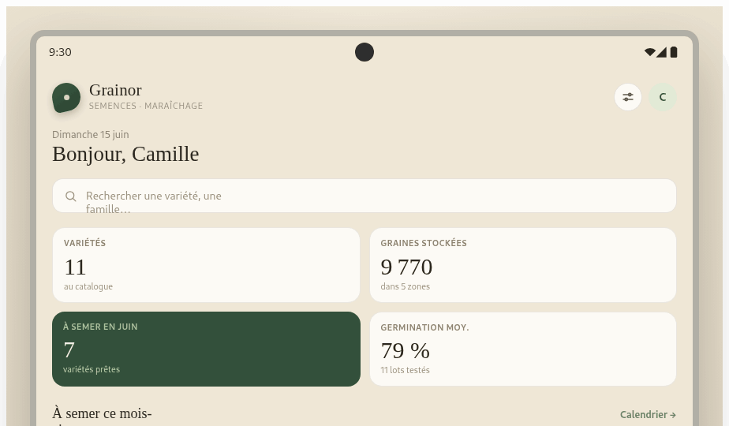
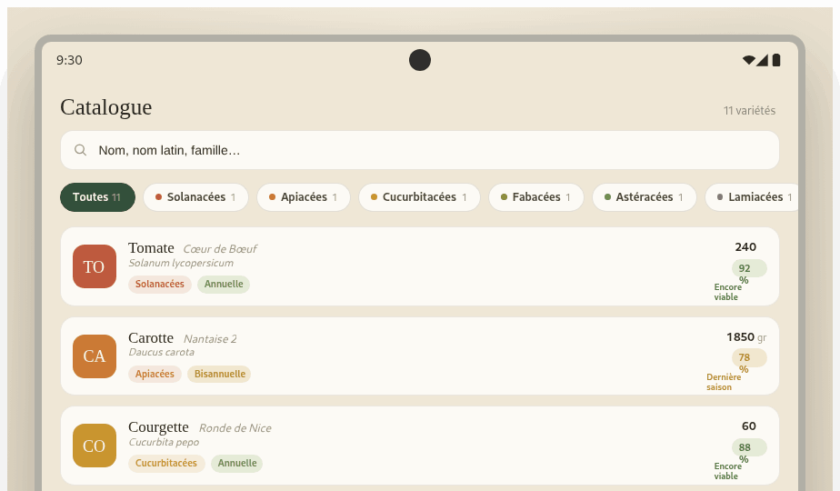
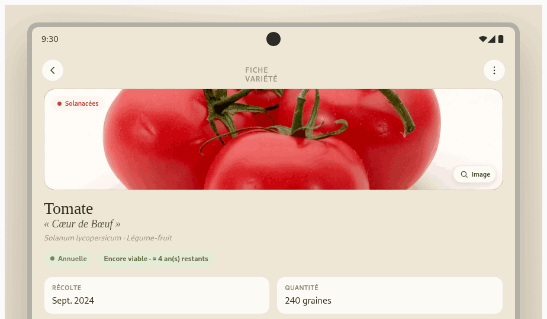
</div>

**Fiche détail (conservation · guide) · Récoltes**

<div align="center">
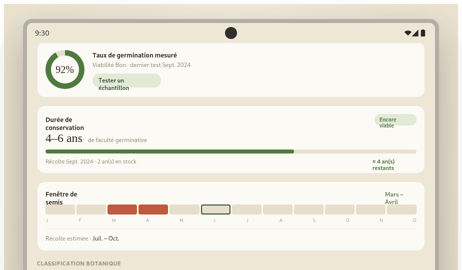
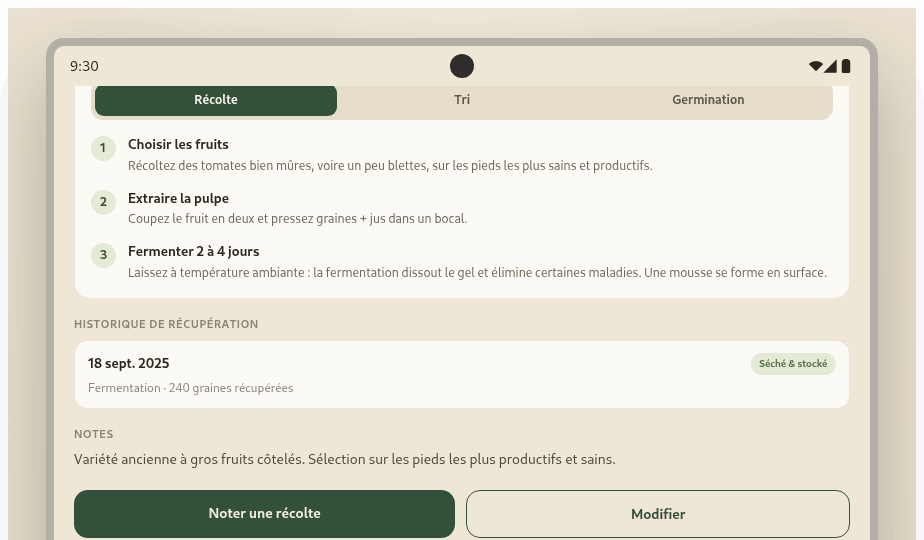
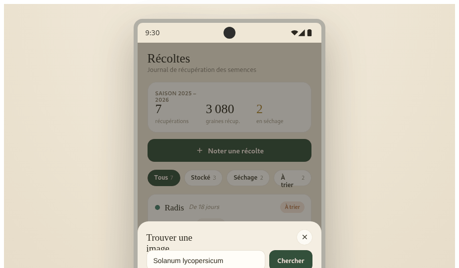
</div>

**Noter une récolte · Inventaire · Calendrier (par mois)**

<div align="center">
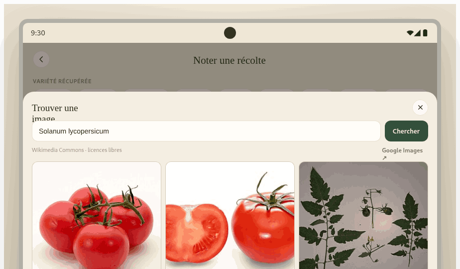
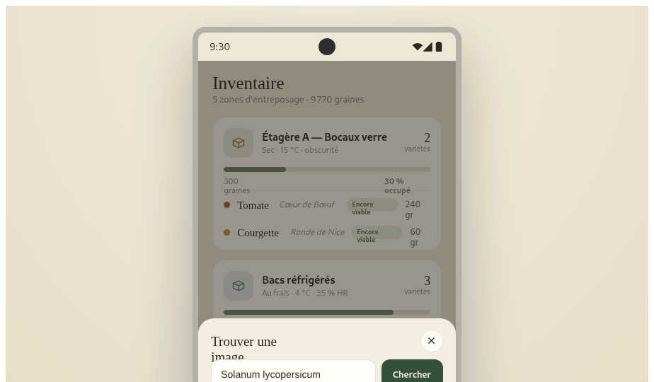
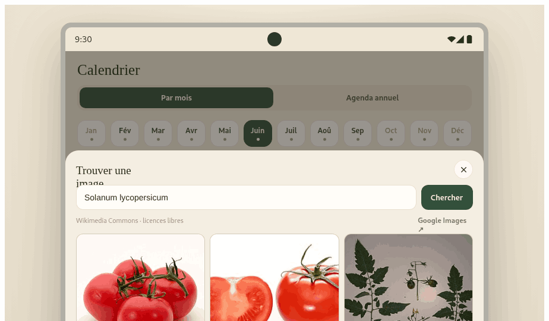
</div>

**Calendrier (agenda annuel) · Ajouter (assistant IA) · Paramètres**

<div align="center">
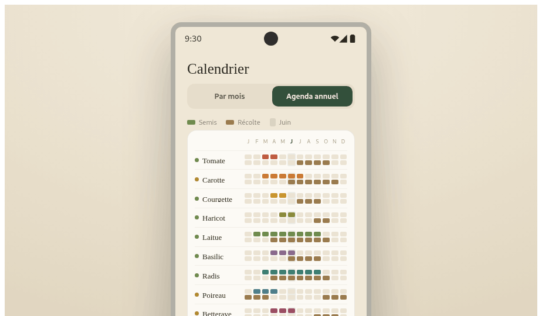
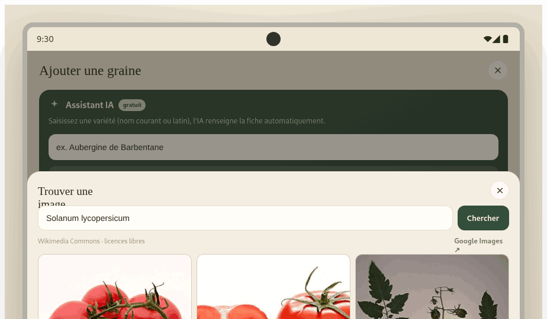

</div>

---

## 🎨 Identité visuelle

Une esthétique **papier / herbier** : fond crème, vert forêt, titres en serif.

| Rôle | Couleur | |
|------|---------|---|
| Fond | `#EFE7D6` | 🟫 |
| Surface (cartes) | `#FCFAF5` | ⬜ |
| Primaire (vert forêt) | `#33503B` | 🟩 |
| Texte | `#2B271F` | ⬛ |

- **Typographies** — [Newsreader](https://fonts.google.com/specimen/Newsreader) (serif, pour les noms de variétés, titres et chiffres) + [Hanken Grotesk](https://fonts.google.com/specimen/Hanken+Grotesk) (sans, pour l'UI).
- **Repérage** — code couleur par **famille botanique** et par **cycle de vie**.
- **Icônes** — outline (trait 1.7–1.9), **aucun emoji dans l'app**.
- **Cartes** — bordure fine, **pas d'ombre portée** ; rayons 12–18 px ; cibles tactiles ≥ 44 px.

Tous les tokens sont centralisés dans [`GrainorApp/src/theme/tokens.ts`](GrainorApp/src/theme/tokens.ts).

---

## 🧠 Logique métier

- **Viabilité** calculée par durée de faculté germinative → libellés *Encore viable* / *Dernière saison* / *Hors durée*.
- **Germination mesurée** → bandes de couleur Bon / Moyen / Faible.
- **Fenêtre de semis** pouvant **traverser l'année** (ex. novembre → février).
- **Remplissage de zone** en % (alerte au‑delà de 85 %).
- **Guides de récupération** espèce par espèce (récolte / tri / germination).

Détails dans [`CONTEXT.md`](CONTEXT.md) et [`GrainorApp/src/logic/seeds.ts`](GrainorApp/src/logic/seeds.ts).

---

## 🔌 Intégrations externes

- 🖼️ **Recherche d'image** — Wikimedia Commons (API publique, sans clé) + lien Google Images.
- 🤖 **Assistant IA** — [OpenRouter](https://openrouter.ai/). Une fois la clé enregistrée, l'app
  récupère la **liste live de tous les modèles gratuits** (sélection persistée). Depuis le
  **Catalogue**, une recherche sans résultat propose de **créer la variété avec l'IA** : la
  proposition remplit **toute** la fiche (germination, classification, culture, et le guide
  Récolte · Tri · Germination) et reste **validée par l'utilisateur** avant enregistrement.
- 💾 **Sauvegarde / restauration** — variétés et récoltes **persistées localement** ; **export /
  import JSON** dans les Paramètres pour changer de téléphone sans rien perdre. L'import accepte un
  **collage** ou un **fichier** (« Charger un fichier… », web), en **ajout** ou en **remplacement**
  du catalogue (case dédiée), et un bouton **Réinitialiser le catalogue** permet de repartir de
  zéro. Le bouton **Modifier** d'une fiche ouvre un formulaire d'édition.
- 🌱 **Génération de catalogue hors‑ligne** — [`scripts/generate-varieties.sh`](scripts/generate-varieties.sh)
  produit des fiches variétés complètes via OpenRouter (cache résumable, clé jamais en dur) et
  assemble un `grainor-varietes.json` prêt à importer. Les guides Récolte · Tri · Germination y
  décrivent la **récupération des graines** (grainothèque), pas la culture du légume.

> 🔐 **Sécurité — important.** La clé API OpenRouter est saisie dans les Paramètres et stockée
> dans le **stockage local sécurisé** de l'appareil (`expo-secure-store`). Elle n'est **jamais**
> écrite en dur dans le code, ni committée. **Ne committez jamais votre clé OpenRouter.**

---

## 🛠️ Stack technique

- **React Native + Expo** (SDK 56) · **TypeScript** (strict)
- **React Navigation** — onglets bas + pile native, barre d'onglets personnalisée
- **react-native-svg** — icônes outline, jauge de germination (anneau), motifs
- **expo-secure-store** (clé API) · **AsyncStorage** (photos & données)
- **@expo-google-fonts** — Newsreader + Hanken Grotesk

---

## 🚀 Démarrer

```bash
cd GrainorApp
npm install
npx expo start          # puis ouvrir dans Expo Go ou un émulateur
```

Vérifications :

```bash
npx tsc --noEmit                          # typage
npx expo export --platform android        # build du bundle
```

---

## 📲 PWA & déploiement Netlify

Le dossier [`web/`](web/) contient tout le nécessaire pour installer Grainor en
**application web (PWA)** sur le téléphone :

```
web/
├── manifest.webmanifest     # nom, couleurs, icônes (purpose any + maskable)
├── head-snippet.html        # balises <head> à injecter (manifest, favicons, apple-touch)
└── icons/
    ├── icon.svg / icon-maskable.svg   # sources vectorielles (régénérables)
    ├── icon-192.png / icon-512.png
    ├── icon-maskable-192.png / icon-maskable-512.png
    ├── apple-touch-icon.png (180×180)
    ├── favicon.ico + favicon-16/32.png
```

L'app tourne en **web** (`react-native-web`). Un script post‑export rend l'export Expo
installable en PWA (injection du `<head>`, copie des icônes/manifest, fallback SPA).

**Build local :**

```bash
cd GrainorApp
npm run build:web        # expo export web + post-traitement PWA → GrainorApp/dist/
npx serve dist           # (optionnel) prévisualiser localement
```

**Déploiement Netlify — automatique** via [`netlify.toml`](netlify.toml) (déjà configuré) :

1. Sur Netlify : *Add new site → Import from Git* → ce dépôt. Le `netlify.toml` fixe
   `base = GrainorApp`, `command = npm ci && npm run build:web`, `publish = GrainorApp/dist`.
2. Déploiement déclenché à chaque push. (Ou en CLI : `netlify deploy --prod`.)
3. Sur le téléphone : ouvrir le site → *Ajouter à l'écran d'accueil*. L'icône 🌱 Grainor apparaît,
   l'app s'ouvre en plein écran (`display: standalone`).

> Le script [`GrainorApp/scripts/web-pwa.mjs`](GrainorApp/scripts/web-pwa.mjs) corrige le titre/la
> langue, injecte manifest + `theme-color` + apple‑touch‑icon, copie `web/icons/` et écrit un
> `_redirects`. Idempotent et réexécutable.

---

## 🗂️ Structure du dépôt

```
Grainor/
├── GrainorApp/             # application Expo / React Native
│   ├── App.tsx             # polices + providers + navigation
│   └── src/
│       ├── theme/          # tokens de design (source unique)
│       ├── data/           # jeu de données de démo (variétés, récoltes, guides)
│       ├── logic/          # logique métier (viabilité, germination, zones…)
│       ├── store/          # état global (offline-first, SecureStore)
│       ├── components/     # Icon, primitives UI, jauge, recherche d'image
│       ├── screens/        # écrans (Catalogue, Fiche détail, …)
│       └── navigation/     # onglets + pile + FAB
├── web/                    # PWA : manifest + icônes + snippet <head>
├── scripts/                # génération des fiches variétés (OpenRouter) + cache résumable
├── design_handoff_grainor/ # spec fonctionnelle + design + captures de référence
├── CONTEXT.md              # contexte d'architecture & de design (pour contributeurs/agents)
└── CHANGELOG.md            # journal des versions
```

---

## 📄 Licence

[MIT](GrainorApp/LICENSE) — © 2026
