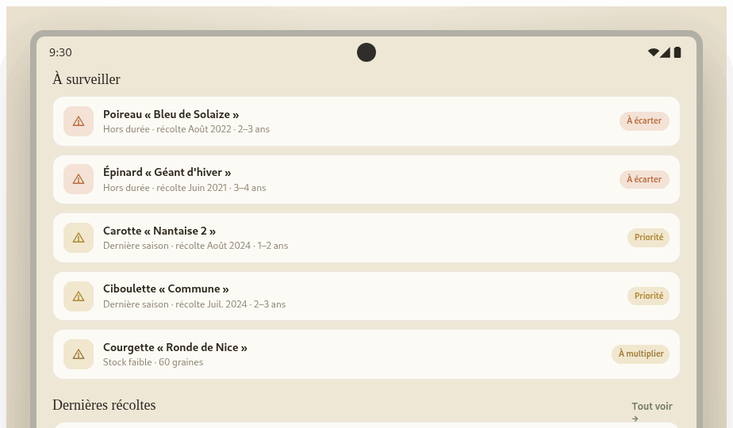
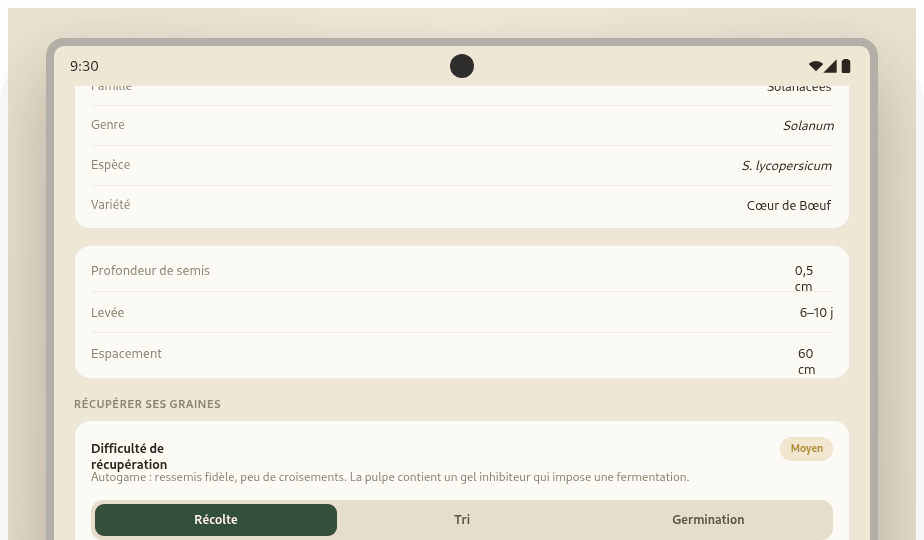
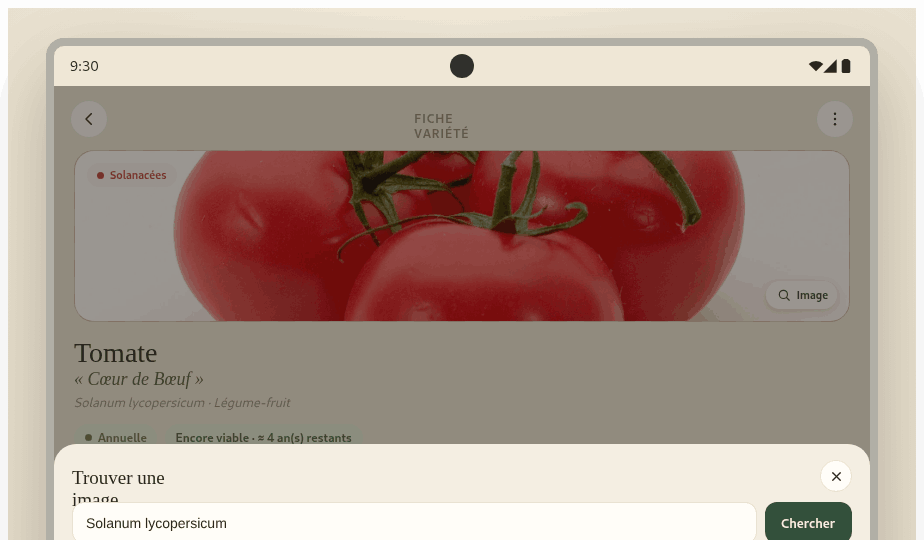
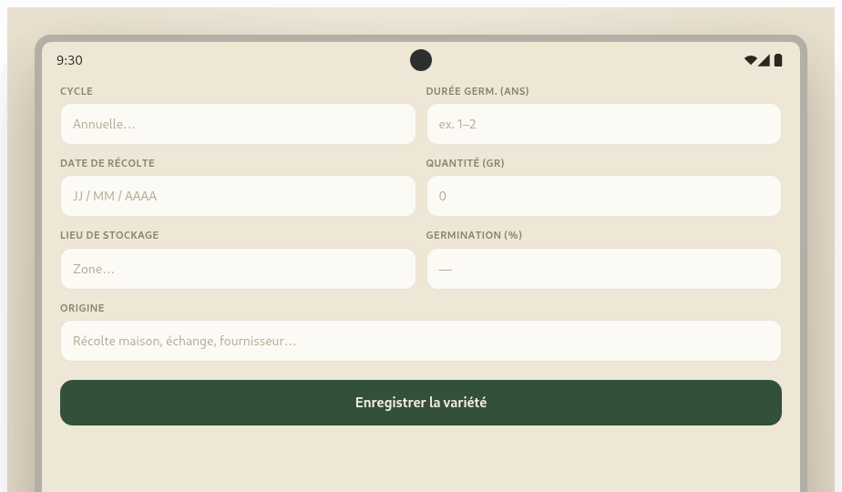

# Grainor — Package de handoff pour Claude Code

> Application mobile (Android) de **gestion de semences** pour maraîchers semi‑professionnels :
> catalogue, classification botanique, inventaire/entreposage, calendrier de semis,
> suivi de récolte/récupération des graines, et durée de faculté germinative.

Ce dossier contient **tout le nécessaire** pour qu'un développeur (ou Claude Code) implémente
l'application en respectant fidèlement le design validé.

```
design_handoff_grainor/
├── README.md                ← ce fichier (spécification design + fonctionnelle)
├── PROMPT.md                ← prompt prêt à coller dans Claude Code
├── design-reference/
│   ├── Grainor.dc.html      ← prototype HTML de référence (source de vérité visuelle)
│   └── android-frame.jsx    ← cadre Android utilisé par le prototype
└── screenshots/             ← 16 captures haute résolution de toutes les vues
```

> ⚠️ **Source de vérité.** En cas de doute sur une couleur, un espacement ou un comportement,
> ouvrez `design-reference/Grainor.dc.html` dans un navigateur et inspectez l'élément.
> Les captures de `screenshots/` montrent le rendu cible exact.

### Aperçu des écrans

<p>


</p>

*(Détail écran par écran en §4.)*

---

## 1. Vision produit

Grainor s'adresse à un **maraîcher semi‑professionnel** qui produit et conserve ses propres
semences. L'app doit être **dense et efficace** (pas un gadget grand public) : repérage rapide
au champ comme à l'atelier, données fiables, et un vrai savoir‑faire sur la **récupération des
graines** espèce par espèce.

Les 4 piliers fonctionnels :
1. **Classifier** — catalogue des variétés + classification botanique complète.
2. **Entreposer** — inventaire par zone de stockage, quantités, conditions.
3. **Planifier** — calendrier de semis (par mois + agenda annuel semis/récolte).
4. **Récupérer** — journal de récolte de graines + guides « comment procéder » + suivi de viabilité.

---

## 2. Système de design

### 2.1 Couleurs

Palette **naturelle & organique** : fond crème chaud, vert forêt en primaire, accents terre.

| Rôle | Hex | Usage |
|---|---|---|
| `bg` (fond app) | `#EFE7D6` | Fond général de l'écran |
| `surface` (cartes) | `#FCFAF5` | Cartes, champs, lignes de liste |
| `surface-alt` | `#FBF7EE` | Barre de navigation, pastilles claires |
| `primary` (vert forêt) | `#33503B` | Boutons principaux, onglet actif, accents |
| `primary-grad` | `linear-gradient(155deg,#3C5B41,#2A4030)` | Logo, FAB, bandeau IA |
| `primary-soft` | `#E2EAD6` | Fonds de boutons secondaires, avatars |
| `text` (principal) | `#2B271F` | Titres et texte fort |
| `text-muted` | `#8C8270` | Légendes, libellés |
| `text-faint` | `#9A917F` | Texte tertiaire, placeholders |
| `border` | `rgba(80,60,30,0.10)` | Bordures de cartes (≈ `0.10`–`0.16`) |
| `track` (jauges) | `#E7DECB` / `#EAE0CE` | Fond des barres de progression |

**Couleurs sémantiques (statut / viabilité)**

| Sens | Texte | Fond doux |
|---|---|---|
| Bon / viable / réussi (vert) | `#4F7A3F` | `#E3EBD6` |
| Attention / priorité / séchage (ambre) | `#B08A2E` | `#F1E7CF` |
| Alerte / hors‑durée / à trier (terracotta) | `#BC6A43` | `#F3E2D5` |

**Code couleur par famille botanique** (pastille + initiale de carte). C'est un repère visuel central :

| Famille | Hex |
|---|---|
| Solanacées | `#BE5A3E` |
| Apiacées | `#CB7A35` |
| Cucurbitacées | `#C9952F` |
| Fabacées | `#8A8A3A` |
| Astéracées | `#6F8B4E` |
| Lamiacées | `#8A6A8C` |
| Brassicacées | `#3E7E72` |
| Amaryllidacées | `#4E7E8A` |
| Amaranthacées | `#9B4E63` |

> La pastille douce (« soft ») d'une famille = sa couleur à **~13 % d'opacité** sur le fond.

**Cycle de vie**

| Cycle | Texte | Fond doux |
|---|---|---|
| Annuelle | `#6F8B4E` | `#E6EBD7` |
| Bisannuelle | `#B08A2E` | `#F1E7CF` |
| Vivace | `#3E7E72` | `#DCEAE5` |

### 2.2 Typographie

Deux familles Google Fonts :

- **Newsreader** (serif) — noms de variétés, grands titres, chiffres de statistiques.
  Poids 400/500/600 + italique (utilisé pour les noms latins et les variétés « entre guillemets »).
- **Hanken Grotesk** (sans‑serif) — toute l'UI : libellés, corps de texte, boutons, navigation.
  Poids 400/500/600/700.

Échelle indicative (mobile 412 px de large) :

| Élément | Police | Taille / poids |
|---|---|---|
| Grand titre d'écran | Newsreader | 25 px |
| Titre de variété (fiche) | Newsreader | 28 px |
| Chiffre de stat | Newsreader | 30 px |
| Titre de carte / variété (liste) | Newsreader | 17 px |
| Nom latin / variété | Newsreader *italic* | 12–18 px |
| Corps de texte | Hanken Grotesk | 13–14 px |
| Libellé de section (MAJUSCULES) | Hanken Grotesk 600 | 11 px, `letter-spacing: 0.05–0.06em`, `text-transform: uppercase` |
| Légende | Hanken Grotesk | 11–12 px, couleur `text-muted` |
| Onglet de navigation | Hanken Grotesk 600 | 9.5–10 px |

### 2.3 Formes, espacements, ombres

- **Rayons** : cartes `16px`, grandes cartes/zones `18px`, petites cartes & champs `12–14px`,
  pastilles/chips `20–22px` (pilule), FAB `17–18px`, avatars/ronds `50%`.
- **Espacement d'écran** : padding horizontal `20px`. Gap entre cartes `11px`. Padding interne de carte `13–16px`.
- **Ombres** : très discrètes. FAB = `0 10px 22px rgba(42,64,48,0.4)`. Logo = `0 4px 10px rgba(42,64,48,0.28)`.
  Les cartes n'ont **pas** d'ombre portée — elles se distinguent par leur fond clair + bordure fine.
- **Icônes** : style **outline** (trait `1.7–1.9`), jamais de remplissage plein sauf petits points.
  Pas d'emoji dans l'UI.

### 2.4 Le logo

Petite « graine » stylisée : carré `36px` en `border-radius: 52% 52% 52% 8px` (forme de graine),
dégradé vert primaire, incliné `rotate(-12deg)`, avec un point clair `#CFE0BE` au centre.

---

## 3. Navigation

**Barre d'onglets fixe en bas** (5 onglets) + **bouton d'action flottant (FAB)** en bas à droite.

`Accueil · Catalogue · Récoltes · Inventaire · Calendrier`

- Onglet actif = vert primaire `#33503B` ; inactif = `#A89E89`.
- Le **FAB** (vert, icône `+`) ouvre l'écran **Ajouter une graine**. Il est masqué sur les écrans
  de détail, d'ajout, « noter une récolte » et paramètres.
- L'**icône Paramètres** (réglages) est en haut de l'écran Accueil, à côté de l'avatar.
- La **fiche détail** s'ouvre depuis n'importe quelle liste et propose un retour `←` vers l'écran précédent.

---

## 4. Les écrans

> Les images ci‑dessous sont les captures haute résolution du rendu cible (dossier `screenshots/`).
> Elles font foi pour le pixel‑perfect.

### 4.1 Accueil

<p>


</p>

- En‑tête : logo Grainor + sous‑titre « Semences · Maraîchage », icône Paramètres, avatar.
- Salutation (« Bonjour, Camille ») + date.
- Barre de recherche (raccourci vers le Catalogue).
- **4 tuiles de stats** : Variétés, Graines stockées, À semer ce mois (tuile verte pleine), Germination moyenne.
- Carrousel horizontal **« À semer ce mois‑ci »** (cartes variété avec liseré de couleur famille).
- Section **« À surveiller »** : alertes de viabilité (Hors durée → *À écarter*, Dernière saison → *Priorité*) et stock faible (*À multiplier*).
- Section **« Dernières récoltes »** (aperçu des 3 dernières, lien « Tout voir »).

### 4.2 Catalogue

<p></p>

- Recherche plein texte (nom, nom latin, famille).
- **Chips de filtre par famille** (défilement horizontal) : « Toutes » + une chip par famille (avec compteur). Chip active = vert plein.
- Liste de variétés. Chaque ligne : carré coloré (famille) avec initiales, nom (serif) + variété, nom latin,
  **2 pastilles** (famille + cycle), et à droite : quantité (gr), taux de germination (pastille colorée),
  libellé de viabilité (Encore viable / Dernière saison / Hors durée).

### 4.3 Fiche détail

<p>





</p>

La vue la plus riche. De haut en bas :
1. **Visuel** (172 px) : photo si renseignée, sinon trame rayée couleur famille. Pastille famille en haut‑gauche, bouton **« Image »** en bas‑droite (ouvre la recherche d'image).
2. Titre (nom) + variété « entre guillemets » (serif italic) + nom latin · type.
3. **2 pastilles** : cycle (Annuelle/Bisannuelle/Vivace) et viabilité (`{vlabel} · {vsub}`).
4. **Grille 2×2** : Récolte (date), Quantité, Stockage, Origine.
5. **Jauge de germination** (anneau conique) + bouton « Tester un échantillon ».
6. **Durée de conservation** *(important)* : durée de faculté germinative (ex. « 1–2 ans »),
   barre de progression colorée selon viabilité, années en stock, statut.
7. **Fenêtre de semis** : 12 cases (mois), cases actives en couleur famille, mois courant entouré.
8. **Classification botanique** *(important)* : 7 lignes — Embranchement, Classe, Ordre, Famille, Genre *(italic)*, Espèce *(italic)*, Variété.
9. Caractéristiques de culture : Profondeur de semis, Levée, Espacement.
10. **« Récupérer ses graines »** *(important)* : indice de **Difficulté** (Facile/Moyen/Difficile) + note sur le mode de reproduction/isolement, puis **3 onglets — Récolte · Tri · Germination** avec **étapes numérotées** « comment procéder ».
11. **Historique de récupération** (lignes datées avec méthode, quantité, statut).
12. Notes libres.
13. Actions : « Noter une récolte » (plein) + « Modifier » (contour).

### 4.4 Récoltes

<p>


</p>

- Bandeau de saison : nb de récupérations, total de graines récupérées, nb en séchage.
- Bouton « Noter une récolte ».
- Chips de filtre par statut (Tous / Stocké / Séchage / À trier).
- Liste des récoltes : variété, pastille statut, date, méthode (chip), quantité, notes.
- **Noter une récolte** : sélection de variété (chips), date, quantité, **méthode d'extraction**
  (Battage / Fermentation / Extraction humide / Écossage), **statut** (Séchage / À trier / Séché & stocké), notes.

### 4.5 Inventaire

<p></p>

- 5 **zones d'entreposage** (étagères, bacs réfrigérés, bocaux hermétiques, armoire…).
- Par zone : icône, nom, conditions (T°, HR), nb de variétés, **barre de remplissage** (% occupé,
  passe en terracotta au‑delà de 85 %), total de graines, puis la liste des variétés stockées
  (point famille, nom, variété, pastille de viabilité, quantité).

### 4.6 Calendrier

<p>


</p>

Bascule segmentée **« Par mois » / « Agenda annuel »** :
- **Par mois** : sélecteur de mois (chips) + liste des variétés à semer ce mois‑ci, chacune avec sa frise de 12 cases.
- **Agenda annuel** : tableau **1 ligne par variété × 12 mois**. Chaque cellule = 2 mini‑barres
  empilées : **semis** (couleur famille) au‑dessus, **récolte** (brun `#9A7B4E`) en dessous. Mois courant surligné. Légende en haut.

### 4.7 Ajouter une graine

<p>


</p>

- **Carte « Assistant IA »** (bandeau vert) en haut : champ « nom de variété » + bouton « Remplir automatiquement »
  (ou renvoi aux Paramètres si pas de clé). Affiche ensuite une **proposition** structurée à valider.
- Séparateur « ou via le scan / saisie manuelle ».
- Zone de **scan d'étiquette** (cadre avec coins) + « Ouvrir l'appareil photo ».
- Formulaire manuel : Nom, Nom latin, Famille (chips), Cycle, Durée germinative (ans), Date de récolte,
  Quantité, Lieu de stockage, Germination (%), Origine.

### 4.8 Paramètres

<p></p>

- **Assistant IA — OpenRouter** : champ clé API (`sk-or-v1-…`), sélecteur de modèle gratuit, bouton Enregistrer.
  Lien « Obtenir une clé gratuite ». La clé est stockée **localement** (jamais envoyée ailleurs qu'à OpenRouter).
- Bloc « À propos » : rappel que réglages + images choisies restent sur l'appareil.

---

## 5. Modèle de données

### 5.1 `Seed` (variété de graine)

```ts
type Cycle = 'Annuelle' | 'Bisannuelle' | 'Vivace';
type Difficulte = 'Facile' | 'Moyen' | 'Difficile';

interface GuideStep { titre: string; detail: string; }

interface Seed {
  id: number;
  nom: string;              // "Tomate"
  cultivar: string;         // variété, ex. "Cœur de Bœuf"
  latin: string;            // "Solanum lycopersicum"
  // Classification botanique (embranchement commun = "Angiospermes")
  embranchement: string;    // "Angiospermes"
  classe: string;           // "Dicotylédones" | "Monocotylédones"
  ordre: string;            // "Solanales"
  famille: string;          // "Solanacées"  (→ couleur famille)
  genre: string;            // "Solanum"
  espece: string;           // "S. lycopersicum"
  // Cycle & culture
  cycle: Cycle;
  type: string;             // "Légume-fruit", "Aromatique", ...
  semisDebut: number;       // mois 1–12
  semisFin: number;         // mois 1–12
  recolteDebut: number;     // mois 1–12 (fenêtre de récolte)
  recolteFin: number;       // mois 1–12 (peut "boucler", ex. 10 → 3)
  profondeur: string;       // "0,5 cm"
  levee: string;            // "6–10 j"
  espacement: string;       // "60 cm"
  recolteMois: string;      // libellé "Juil. – Oct."
  // Stock & viabilité
  quantite: number;         // nb de graines
  germination: number;      // taux mesuré en %
  recolteLabel: string;     // "Sept. 2024"
  recolteAnnee: number;     // 2024
  longeviteMin: number;     // années de faculté germinative (min)
  longeviteMax: number;     // années (max)
  origine: string;          // "Récolte maison" | "Échange grainothèque" | ...
  zone: 'A'|'B'|'C'|'D'|'E';
  stockage: string;         // "Étagère A · Bocal 2"
  notes: string;
  // Guide de récupération
  difficulte: Difficulte;
  reproduction: string;     // note autogamie/allogamie + isolement
  guideRecolte: GuideStep[];
  guideTri: GuideStep[];
  guideGermination: GuideStep[];
}
```

### 5.2 `Harvest` (récolte / récupération)

```ts
interface Harvest {
  id: number;
  seedId: number;
  date: string;             // ISO, ex. "2025-09-18"
  quantite: number;         // graines récupérées
  methode: 'Battage' | 'Fermentation' | 'Extraction humide' | 'Écossage';
  statut: 'stocke' | 'sechage' | 'trier';
  notes: string;
}
```

### 5.3 `StorageZone` (zone d'entreposage)

```ts
interface StorageZone {
  id: 'A'|'B'|'C'|'D'|'E';
  nom: string;              // "Bacs réfrigérés"
  conditions: string;       // "Au frais · 4 °C · 35 % HR"
  capacite: number;         // nb de graines max (pour le % de remplissage)
}
```

> Le jeu de données complet (11 variétés réalistes + 7 récoltes + 5 zones + tous les guides
> espèce par espèce) est présent dans `design-reference/Grainor.dc.html` — **réutilisez‑le tel quel**
> comme données de démonstration (`seed data`).

---

## 6. Logique métier à reproduire

Ces calculs sont **le cœur** de l'app, à implémenter fidèlement :

### 6.1 Viabilité / durée de faculté germinative *(prioritaire selon le client)*
À partir de `recolteAnnee` et de l'année courante : `anneesEnStock = annéeCourante − recolteAnnee`.

| Condition | Statut (`vlabel`) | Couleur | Sous‑texte (`vsub`) |
|---|---|---|---|
| `anneesEnStock > longeviteMax` | **Hors durée** | terracotta | « Semence périmée » |
| `longeviteMin ≤ anneesEnStock ≤ longeviteMax` | **Dernière saison** | ambre | « À semer en priorité » |
| `anneesEnStock < longeviteMin` | **Encore viable** | vert | « ≈ N an(s) restants » (`longeviteMax − anneesEnStock`) |

Barre de conservation : largeur = `clamp(0,100, (longeviteMax − anneesEnStock) / longeviteMax × 100)` %.

> Exemple métier (à respecter) : une **carotte** a une longévité de **1–2 ans** ; au‑delà elle ne germe plus.
> Le poireau (récolte 2022) et l'épinard (2021) doivent ressortir en **Hors durée**.

### 6.2 Couleur de germination mesurée
`germination ≥ 85` → vert ; `≥ 70` → ambre ; sinon → terracotta. (Mêmes paires texte/fond doux que §2.1.)

### 6.3 Alertes d'accueil « À surveiller »
Concaténer : variétés **Hors durée** (tag « À écarter »), variétés **Dernière saison** (tag « Priorité »),
variétés à **stock faible** `quantite < 100` (tag « À multiplier »).

### 6.4 Remplissage d'une zone
`% = clamp(0,100, totalGrainesZone / capacite × 100)`. Barre en terracotta si `> 85 %`, sinon vert.

### 6.5 « À semer ce mois‑ci » / calendrier
Une variété est « à semer » au mois `m` si `semisDebut ≤ m ≤ semisFin`.
La fenêtre de récolte peut **boucler** sur l'année (`recolteDebut > recolteFin`, ex. poireau 10 → 3) :
`m ∈ récolte` si `(rd ≤ re && rd ≤ m ≤ re) || (rd > re && (m ≥ rd || m ≤ re))`.

---

## 7. Intégrations externes

### 7.1 Recherche d'image — Wikimedia Commons (`08-recherche-image.png`)
- Appel **public, sans clé** à l'API MediaWiki de Commons :
  ```
  https://commons.wikimedia.org/w/api.php?action=query&generator=search
    &gsrnamespace=6&gsrsearch=<REQUÊTE>&gsrlimit=18
    &prop=imageinfo&iiprop=url|mime&iiurlwidth=320&format=json&origin=*
  ```
  Filtrer sur les types `image/jpeg|png|gif|webp`. Pré‑remplir la requête avec le **nom latin** de la variété.
- Bouton **« Google Images ↗ »** = simple lien externe
  `https://www.google.com/search?tbm=isch&q=<REQUÊTE>` (Google n'expose pas d'API d'images libre).
- L'image choisie est associée à la variété et **persistée localement**.

### 7.2 Assistant IA — OpenRouter
- Clé API saisie dans Paramètres, stockée **localement** (jamais commitée ; pas de clé en dur).
- Modèles **gratuits** proposés : `meta-llama/llama-3.3-70b-instruct:free`,
  `google/gemini-2.0-flash-exp:free`, `deepseek/deepseek-r1:free`, `qwen/qwen-2.5-72b-instruct:free`.
- Endpoint : `POST https://openrouter.ai/api/v1/chat/completions`,
  header `Authorization: Bearer <clé>`. Prompt système qui **impose une réponse JSON** avec les champs
  de `Seed` (voir le code de référence pour le prompt exact). Parser le JSON (fallback : extraire le
  premier bloc `{…}`), afficher une **proposition à valider** avant d'enregistrer.
- Les valeurs IA sont une **aide à la saisie** : toujours révisables par l'utilisateur.

---

## 8. Recommandations techniques

Le prototype est en HTML/CSS inline + une petite classe de logique. Pour une vraie app Android, suggestions
(non imposées — suivez les conventions du client si elles existent) :

- **React Native / Expo** ou **Flutter** pour le natif Android ; sinon **React + Capacitor**.
- **Persistance locale** : AsyncStorage / SQLite / Room (selon la stack). Tout fonctionne hors‑ligne ;
  seules les intégrations §7 sortent sur le réseau.
- **Stockage des secrets** : la clé OpenRouter va dans le stockage local sécurisé, **jamais** dans le code.
- Centraliser les tokens du §2 (couleurs, typos, rayons) dans un thème unique.
- Polices : charger **Newsreader** et **Hanken Grotesk** (Google Fonts) ; respecter le couple serif/sans.
- Accessibilité : cibles tactiles ≥ 44 px, contrastes respectés (le crème + vert forêt passe AA pour le texte).
- Langue : **français** intégral (libellés, dates, messages).

---

## 9. Définition de « terminé »

- [ ] Les 8 écrans du §4 sont implémentés et fidèles aux captures.
- [ ] Navigation 5 onglets + FAB + écran Paramètres + ouverture/retour de fiche.
- [ ] Modèle de données du §5 + jeu de démo repris du fichier de référence.
- [ ] Toute la logique du §6 (viabilité, alertes, remplissage, calendrier qui boucle).
- [ ] Guides Récolte/Tri/Germination par variété, avec onglets.
- [ ] Agenda annuel (semis + récolte) lisible.
- [ ] Recherche d'image Wikimedia + lien Google Images, image persistée.
- [ ] Assistant IA OpenRouter (clé locale, proposition à valider) — dégradé propre si pas de clé.
- [ ] Tokens de design centralisés, polices chargées, FR intégral, hors‑ligne par défaut.
